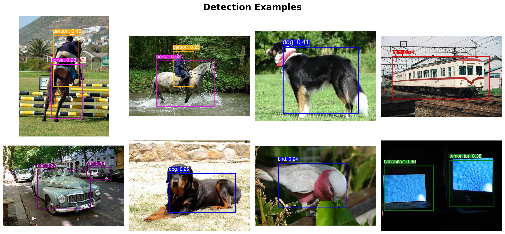

# YOLO v1 Object Detection



[](https://github.com/mattiaskvist/yolo-v1/actions/workflows/pytest.yml)
[](https://opensource.org/licenses/MIT)
[](https://arxiv.org/abs/1506.02640)
[](https://huggingface.co/mattiaskvist/yolo-v1)
[](https://huggingface.co/spaces/mattiaskvist/yolo-v1)

[](https://www.python.org/downloads/)
[](https://pytorch.org/)
[](https://github.com/astral-sh/uv)
[](https://github.com/astral-sh/ruff)

[](https://github.com/mattiaskvist/yolo-v1/stargazers)

A clean, modular PyTorch implementation of **You Only Look Once (YOLO) v1**, the pioneering single-shot object detection model. This implementation features a flexible architecture with support for multiple backbones, distributed training, and comprehensive evaluation metrics.

## Overview

YOLO v1 revolutionized object detection by framing it as a single regression problem, directly predicting bounding boxes and class probabilities from full images in one evaluation. This implementation stays true to the original paper while incorporating modern best practices and engineering improvements.

### Key Features

- **🏗️ Modular Architecture**: Clean separation of concerns with pluggable backbone networks
- **🔄 Transfer Learning**: Support for pretrained ResNet50 backbone with configurable freezing
- **☁️ Distributed Training**: Seamless integration with [Modal](https://modal.com/) for cloud GPU training
- **🎯 Auto Device Detection**: Automatically selects optimal device (MPS for Apple Silicon, CUDA for NVIDIA, CPU fallback)
- **📊 Comprehensive Metrics**: Full mAP@50:95 evaluation with per-class and size-based analysis
- **🧪 Production Ready**: Extensive test coverage and type hints throughout
- **📈 Training Monitoring**: TensorBoard integration for real-time training visualization

## Performance

Evaluated on PASCAL VOC 2007 test set (4,952 images):

| Metric | Score |
|--------|-------|
| **mAP@50:95** | 21.20% |
| **mAP@0.5** | 43.87% |
| **mAP@0.75** | 14.33% |
| **Precision** | 17.47% |
| **Recall** | 52.27% |

### Top Performing Classes (AP@0.5)

| Class | AP@0.5 | Class | AP@0.5 |
|-------|--------|-------|--------|
| Cat | 69.54% | Dog | 67.83% |
| Train | 60.29% | Horse | 61.97% |
| Bus | 50.29% | Bicycle | 54.35% |

### Performance by Object Size

| Size | mAP@50:95 | mAP@0.5 | Count |
|------|-----------|---------|-------|
| Large (≥96×96) | 26.19% | 56.39% | 8,322 |
| Medium (32×32-96×96) | 9.25% | 9.94% | 4,126 |
| Small (<32×32) | 8.18% | 8.18% | 875 |

**Pretrained weights available**: Model checkpoint with ResNet50 backbone trained on PASCAL VOC is available for download on [🤗 Hugging Face](https://huggingface.co/mattiaskvist/yolo-v1).

## Installation

### Prerequisites

- [uv](https://github.com/astral-sh/uv)

### Quick Install

```bash
# Clone the repository
git clone https://github.com/mattiaskvist/yolo-v1.git
cd yolo-v1

# Install dependencies with uv
uv sync
```

### Optional: Modal Setup for Cloud Training

```bash
# Authenticate (follow prompts)
uv run modal setup
```

Make sure you add `KAGGLE_USERNAME` and `KAGGLE_KEY` as secrets in your Modal project for dataset downloads.

## Usage

### Training

#### Local Training

```bash
# Train with auto device detection (MPS/CUDA/CPU)
uv run src/train.py --epochs 135

# Train on specific device
uv run src/train.py --epochs 135 --device mps   # Apple Silicon
uv run src/train.py --epochs 135 --device cuda  # NVIDIA GPU
uv run src/train.py --epochs 135 --device cpu   # CPU only
```

#### Cloud Training with Modal

```bash
# Train on Modal with GPU (L4)
uv run modal run -d src/train.py --epochs 135 --remote

# Resume from checkpoint (if interrupted)
uv run modal run -d src/train.py --resume true --epochs 135 --remote
```

### Evaluation

```bash
# Evaluate model on VOC2007 test set
uv run src/evaluate.py --checkpoint checkpoints/yolo_best.pth

# Evaluate with specific device
uv run src/evaluate.py --checkpoint checkpoints/yolo_best.pth --device mps
```

Note: if trained on Modal, download the checkpoint from the `checkpoints/` directory in your Modal project.

### Inference

**Pretrained weights**: Download the ResNet50 checkpoint from [🤗 Hugging Face](https://huggingface.co/mattiaskvist/yolo-v1/blob/main/yolo_best.pth) and place it in `checkpoints/`.

```bash
# Run inference on images
uv run src/predict.py --checkpoint checkpoints/yolo_best.pth --image-dir path/to/images/

# Adjust confidence and NMS thresholds
uv run src/predict.py \
    --checkpoint checkpoints/yolo_best.pth \
    --image-dir path/to/images/ \
    --conf-threshold 0.3 \
    --nms-threshold 0.4
```

## Architecture

### Model Overview

- **Grid Size (S)**: 7×7
- **Bounding Boxes per Cell (B)**: 2
- **Classes (C)**: 20 (PASCAL VOC)
- **Input Size**: 448×448 RGB
- **Output**: 7×7×30 tensor (per cell: 2 boxes × 5 predictions + 20 class probabilities)

### Backbone Options

1. **YOLOv1Backbone**: Original architecture from the paper
   - 24 convolutional layers
   - Alternating 1×1 and 3×3 convolutions
   - Leaky ReLU activation (α=0.1)

2. **ResNetBackbone**: Transfer learning with ResNet50
   - Pretrained on ImageNet
   - Configurable layer freezing
   - Faster convergence
   - Weights available on [🤗 Hugging Face](https://huggingface.co/mattiaskvist/yolo-v1)

## Dataset

Training and evaluation use **PASCAL VOC 2007 and 2012** datasets:

- **Training**: VOC 2007 trainval + VOC 2012 trainval (~16,551 images)
- **Validation**: VOC 2007 test (4,952 images)
- **Classes**: 20 object categories (person, car, dog, etc.)

Datasets are automatically downloaded from Kaggle during first training.

## License

This project is licensed under the MIT License - see the [LICENSE](LICENSE) file for details.

## Citation

If you use this project in your research, please cite the original YOLO paper:

```bibtex
@article{Redmon_2016_CVPR,
    author    = {Redmon, Joseph and Divvala, Santosh and Girshick, Ross and Farhadi, Ali},
    title     = {You Only Look Once: Unified, Real-Time Object Detection},
    booktitle = {Proceedings of the IEEE Conference on Computer Vision and Pattern Recognition (CVPR)},
    month     = {June},
    year      = {2016}
}
```
